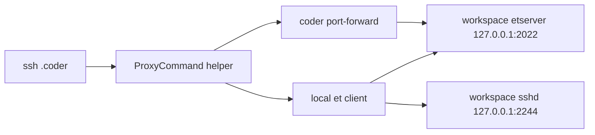

# Hakim: Universal Coder Templates

Hakim provides Coder templates and prebuilt DevContainer images for AI-assisted development across multiple language stacks.

## DevContainer Images

Images follow the DevContainer Features model and are also OCI-ready for Proxmox LXC usage. The base image can run `coder agent` directly through `CODER_AGENT_URL` and `CODER_AGENT_TOKEN`.

| Image | Variant | Key tooling | Description |
| :--- | :--- | :--- | :--- |
| `hakim-base` | Base | `mise`, common utils | Minimal Debian Trixie image with Docker client and core tooling. |
| `hakim-php` | PHP | `php:8.4`, `laravel`, `nodejs`, `bun` | Laravel-focused workspace with PHP and JS runtimes. |
| `hakim-dotnet` | .NET | `dotnet:10`, `dotnet:latest`, `nodejs`, `bun` | .NET SDKs with JS runtimes. |
| `hakim-rust` | Rust | `rust:stable`, `nodejs`, `bun` | Rust toolchain with JS runtimes. |
| `hakim-js` | JS | `nodejs:lts`, `bun:latest` | JavaScript workspace with Node.js LTS and Bun. |
| `hakim-elixir` | Elixir | `elixir`, `phoenix`, `postgresql-tools`, `nodejs`, `bun` | Elixir/Phoenix workspace with PostgreSQL client tools and JS runtimes. |

## Templates

- Docker template: `coder/templates/hakim`
- Proxmox template: `coder/templates/hakim-proxmox`
- GitHub Actions template: `coder/templates/hakim-github-actions`

For Proxmox, templates are pre-pulled into `vztmpl` storage. With `enable_home_disk = true`, `/home/coder` is persisted and Docker data is stored at `/home/coder/.local/share/docker` to survive container rebuilds.

The GitHub Actions template runs the published Hakim GHCR images on GitHub-hosted runners, keeps the workspace step under 350 minutes, and stores encrypted `/home/coder` snapshots as Actions artifacts for restartable one-off workspaces.

The Coder control plane for that template should run on the custom `hakim-coder` image, which extends the official Coder image with provisioner-side tools such as `jq` and `age` and bundles the custom Hakim Terraform provider used to manage GitHub Actions runs. Its Terraform CLI config is stored outside `/home/coder` so persistent home mounts do not hide the provider mirror.

## Common Template Parameters

| Parameter | Description | Default |
| :--- | :--- | :--- |
| `image_variant` | Workspace image variant | `base` |
| `git_repo_url` | Repository to clone on startup | `""` |
| `opencode_auth` | OpenCode auth JSON | `{}` |
| `opencode_config` | OpenCode config JSON | `{}` |
| `default_env` / `secret_env` | Environment variable injection | `{}` |
| `preview_port` | Preview app port | `3000` |
| `setup_script` | Startup shell script | `""` |
| `snapshot_ageignore` | Seed content for `/home/coder/.ageignore` used during encrypted snapshots | common transient paths |
| `enable_et` | Enable ET-based resilient SSH transport | `true` |

## GitHub Actions Template Setup

- Install local tooling with `mise install` so `age` and `terraform` are available.
- Generate the snapshot encryption key with `secret_key="$(mise exec -- age-keygen)"`.
- Derive the public key with `public_key="$(printf '%s\n' "$secret_key" | mise exec -- age-keygen -y /dev/stdin)"`.
- Store the private key in the control repo secret `HAKIM_WORKSPACE_AGE_SECRET_KEY`.
- Set template `secret_env` to include `GITHUB_API_TOKEN`; the template uses it both for provider-side Actions dispatch/stop and for `GH_TOKEN` inside the workspace container.
- Paste `public_key` into the template parameter `actions_age_public_key`.
- Control-plane workflow assets live in `.github/workflows/hakim-workspace.yml` and `.github/scripts/hakim-workspace.sh`.
- Build the control-plane image locally with `scripts/build-coder-image.sh`, which reads `CODER_VERSION` from the environment or `.env` and tags `hakim-coder:<CODER_VERSION>`.
- Build the local provider binary with `scripts/build-terraform-provider-hakim.sh` when you need a dev override outside the custom Coder image.

## Resilient SSH (Optional ET Mode)

`enable_et` is enabled by default. Workspace side services run on loopback only:

- `etserver` on `127.0.0.1:2022`
- `sshd` on `127.0.0.1:2244`


```mermaid
flowchart LR
  A[ssh <workspace>.coder] --> B[ProxyCommand helper]
  B --> C[coder port-forward]
  B --> D[local et client]
  C --> E[workspace etserver 127.0.0.1:2022]
  D --> E
  D --> F[workspace sshd 127.0.0.1:2244]
```

Set ProxyCommand on developer machine:

```sshconfig
Host coder.* *.coder
  User coder
  IdentitiesOnly yes
  IdentityFile ~/.ssh/coder-keys/%h/id_ed25519
  StrictHostKeyChecking accept-new
  UserKnownHostsFile ~/.ssh/coder_known_hosts
  ProxyCommand ~/.ssh/scripts/coder-et-proxy.sh %h %p %r
```

Local prerequisites:

- `coder` CLI
- `et`
- `nc`

Install example (macOS/Homebrew):

```bash
brew install coder/coder/coder MisterTea/et/et netcat
```

References:

- ET website: https://mistertea.github.io/EternalTerminal/
- ET docs/install: https://github.com/MisterTea/EternalTerminal
- Coder docs: https://coder.com/docs
- ET module details and FAQ: `coder/modules/et/README.md`

## Build

Prerequisites:

- Docker
- `@devcontainers/cli`

Build all images:

```sh
./scripts/build.sh
```

## Extending Hakim

Add a feature:

1. Create `devcontainers/.devcontainer/features/src/<feature-name>`
2. Add `devcontainer-feature.json` and `install.sh`
3. Optionally wrap upstream features via `features` in `devcontainer-feature.json`

Add a new image variant:

1. Create `devcontainers/.devcontainer/images/<variant>/.devcontainer/devcontainer.json`
2. Base it on `ghcr.io/shekohex/hakim-base:latest`
3. Reference feature paths from `../../../features/src/<feature>`

## License

MIT
