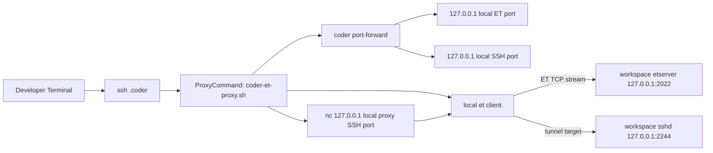
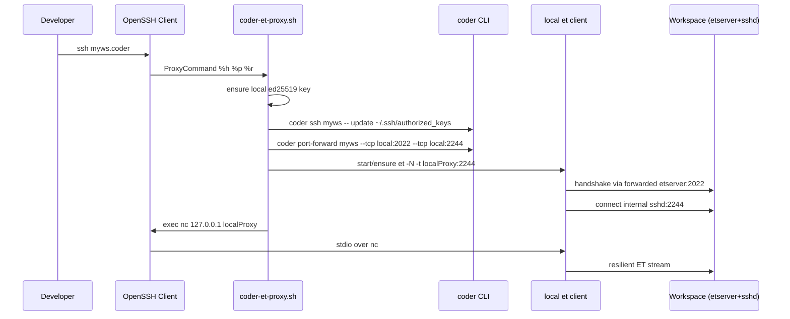

# EternalTerminal (ET)

This module runs loopback `etserver` and hardened loopback `sshd` inside a workspace, then a local ProxyCommand helper wires normal `ssh <workspace>.coder` into ET transport.

## Workspace Topology



## Connection Sequence



## Developer Setup

### Local prerequisites

Required on developer machine for `coder-et-proxy.sh`:

- `coder` CLI
- `et` (EternalTerminal client)
- `nc` (netcat)

Official references:

- ET website: https://mistertea.github.io/EternalTerminal/
- ET official docs/README: https://github.com/MisterTea/EternalTerminal
- Coder CLI docs: https://coder.com/docs

Install examples:

```bash
# macOS (Homebrew)
brew install coder/coder/coder MisterTea/et/et netcat
```

```bash
# Debian/Ubuntu: Coder CLI per official docs, then:
sudo apt-get update
sudo apt-get install -y netcat-openbsd curl

# ET official Debian repo (from ET README)
sudo mkdir -m 0755 -p /etc/apt/keyrings
echo "deb [signed-by=/etc/apt/keyrings/et.gpg] https://mistertea.github.io/debian-et/debian-source/ $(grep VERSION_CODENAME /etc/os-release | cut -d= -f2) main" | sudo tee /etc/apt/sources.list.d/et.list
curl -sSL https://github.com/MisterTea/debian-et/raw/master/et.gpg | sudo tee /etc/apt/keyrings/et.gpg >/dev/null
sudo apt-get update
sudo apt-get install -y et
```

Run on your laptop/workstation:

```bash
mkdir -p ~/.ssh/scripts ~/.ssh/coder-keys
curl -fsSL https://raw.githubusercontent.com/shekohex/hakim/main/scripts/coder-et-proxy.sh -o ~/.ssh/scripts/coder-et-proxy.sh
chmod 0755 ~/.ssh/scripts/coder-et-proxy.sh
chmod 700 ~/.ssh/scripts ~/.ssh/coder-keys
```

Direct script URL: https://raw.githubusercontent.com/shekohex/hakim/main/scripts/coder-et-proxy.sh

Add to `~/.ssh/config`:

```sshconfig
Host *.coder
  User coder
  ProxyCommand ~/.ssh/scripts/coder-et-proxy.sh %h %p %r
```

Optional local knobs:

- `CODER_ET_KEY_TTL_SECONDS` (default `3600`) rotates per-workspace key.
- `CODER_ET_KEYS_DIR` (default `~/.ssh/coder-keys`) overrides key location.

## Key Model

- Key type is `ed25519` only.
- No RSA is generated/used.
- Per-workspace key is stored under `~/.ssh/coder-keys/<workspace>/id_ed25519`.
- Public key is injected into workspace `~/.ssh/authorized_keys` with marker prefix `hakim-et:<workspace>:`.
- On rotation, old marked keys for that workspace are removed then current key is re-added.
- Keys are not auto-added to ssh-agent, so `ssh-add -L` does not list them unless manually added.

## FAQ

### What is `nc` doing here?

`nc` (netcat) is only the local stdio bridge used by OpenSSH ProxyCommand. It forwards stdin/stdout to local ET-listening port.

### Does laptop sleep break `nc`?

`nc` can drop when the laptop sleeps. ET is the resilience layer and reconnects the transport; the next SSH invocation re-establishes local helper processes as needed.

### Is this TCP or stdio?

- OpenSSH to ProxyCommand: stdio
- ProxyCommand to ET local endpoint: local TCP (`nc`)
- ET local to workspace etserver: TCP (through `coder port-forward`)
- ET to internal workspace sshd: TCP tunnel target

### Overhead concerns?

There are extra local processes (`coder port-forward`, `et`, `nc`) and one additional handshake path versus direct `ssh`. In return you get session continuity behavior across transient network interruptions.
