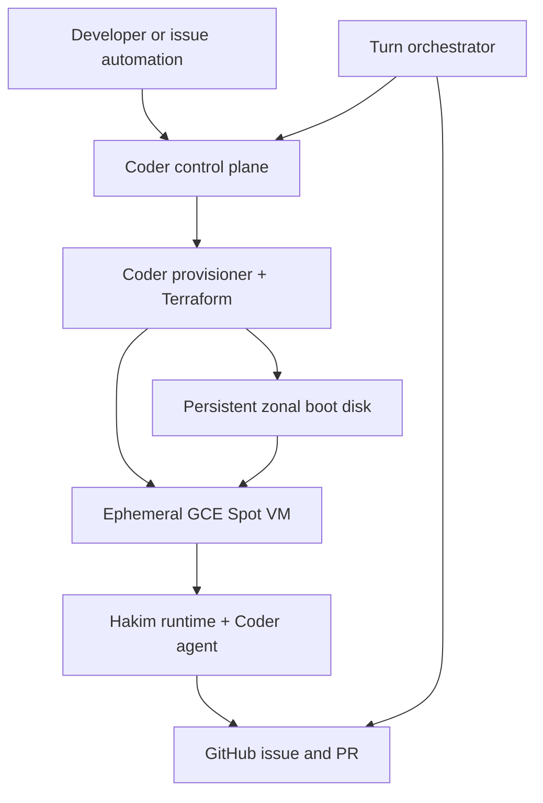

# Product Requirements Document: Hakim GCP Spot Workspaces

**Status:** Proposed  
**Owner:** shekohex  
**Repository:** [shekohex/hakim](https://github.com/shekohex/hakim)  
**Target template:** `coder/templates/hakim-gcp-spot`  
**Last updated:** 2026-09-15  
**Primary workflow:** one Coder workspace per GitHub issue / pull request

## 1. Executive summary

Hakim should add a Coder template that creates an inexpensive Google Compute Engine Spot VM for each GitHub issue or pull request. The VM runs a pinned Hakim environment, gives a coding agent an isolated machine, and keeps the issue's working state between feedback turns.

The key lifecycle decision is to separate compute from storage:

- The Spot VM exists only while the Coder workspace is running.
- A standalone zonal persistent disk exists for the full issue/PR lifecycle.
- Stopping the workspace destroys the VM but keeps the disk.
- Starting the same workspace creates a fresh Spot VM and boots from the same disk.
- Deleting the Coder workspace, normally after the PR is merged, deletes both VM and disk.

This makes cost proportional to actual agent runtime plus the comparatively small cost of retained disk space. The user's recurring Google Cloud credit is applied by Google Cloud Billing; Hakim should display estimated usage but must not assume that a budget alert is a hard spending cap.

## 2. Context

Hakim already provides Docker, Proxmox, and GitHub Actions Coder templates plus prebuilt OCI images for multiple language stacks. The GCP template must reuse those conventions rather than creating a separate workspace experience.

The intended workflow is:

1. A GitHub issue is created.
2. A Coder workspace is created for the issue.
3. The workspace starts a GCP Spot VM using a Hakim image.
4. An agent implements the issue, commits changes, and opens or updates a PR.
5. When the turn ends, Coder stops the workspace and deletes the VM.
6. The disk remains while review and feedback are pending.
7. A later start attaches the same disk to a new Spot VM and the agent continues from the preserved state.
8. After the associated PR is merged, the user deletes the Coder workspace; Terraform deletes the remaining disk.

## 3. Product vision

Provide a disposable, isolated development computer per issue while preserving exactly the state that is useful between agent turns. A user should be able to run several issues in parallel without local port conflicts, shared writable filesystem conflicts, or paying for idle compute.

## 4. Goals

### 4.1 Primary goals

- Add a first-class `hakim-gcp-spot` Coder template.
- Model one workspace as one GitHub issue/PR lifecycle.
- Use GCE Spot provisioning for all agent compute by default.
- Charge compute only while a workspace is running.
- Preserve the full boot disk between stop/start cycles.
- Delete persistent resources when the Coder workspace is deleted.
- Reuse Hakim image variants, initialization, auth, Git, agent, editor, and preview conventions.
- Support agent turns from a few minutes through a three-hour hard maximum.
- Make cost visible in hours and minutes, not days.
- Allow safe parallel workspaces with unique compute, disk, network identity, and repository state.

### 4.2 Success metrics

| Metric | Target |
|---|---:|
| Successful cold workspace starts | >= 95% excluding Spot-capacity exhaustion |
| Successful restart with state intact | >= 99% |
| Stop leaves no billable VM | 100% |
| Workspace delete removes managed disk | 100% |
| State-preservation test cycles | 10 consecutive stop/start cycles |
| Maximum automatic turn duration | 180 minutes |
| Orphaned VMs older than policy | 0 after reconciliation |
| Cross-workspace port/filesystem conflicts | 0 by design |

## 5. Non-goals

- Guaranteed uninterrupted compute; Spot VMs can be preempted.
- Multi-zone live migration of a workspace disk in MVP.
- A general-purpose Google Cloud account manager.
- Hosting the Coder control plane on GCP.
- Automatically merging PRs.
- Treating Google Cloud budget alerts as enforcement.
- Sharing a writable boot disk between simultaneous VMs.
- Supporting untrusted multi-tenant workloads inside one VM.

## 6. Personas and user stories

### 6.1 Primary user

A developer operating a self-hosted Coder deployment who wants to delegate GitHub issues to coding agents without permanently reserving local or cloud compute.

### 6.2 Core stories

- As a developer, I can paste a GitHub issue URL and choose a Hakim environment and VM size.
- As a developer, I can start a workspace, let the agent work, then stop it immediately when the turn ends.
- As a reviewer, I can restart the same workspace after leaving PR feedback and continue with all prior files and installed tools intact.
- As a cost-conscious operator, I can see estimated compute and retained-disk cost using runtime hours/minutes.
- As an operator, I can delete the workspace after merge and know its VM and disk are gone.
- As an operator, I can identify and reconcile resources if Terraform or Coder is interrupted.

## 7. Lifecycle model

```mermaid
stateDiagram-v2
    [*] --> Creating: issue workspace created
    Creating --> Running: disk and Spot VM ready
    Running --> Stopped: turn ends; VM destroyed
    Stopped --> Running: new Spot VM boots same disk
    Running --> Stopped: review iteration ends
    Stopped --> Deleting: PR merged and workspace deleted
    Running --> Deleting: explicit workspace deletion
    Deleting --> [*]: VM and disk deleted
```



### 7.1 Resource behavior

| Coder operation | Spot VM | Persistent boot disk | Git/repo state | Cost state |
|---|---|---|---|---|
| Create/start | Create | Create once or reuse | Clone only if absent | Compute + disk |
| Agent working | Running | Attached read/write | Updated normally | Compute + disk |
| Stop | Destroy | Keep | Preserved | Disk only |
| Start again | Recreate | Reattach as boot disk | Continue existing worktree | Compute + disk |
| Delete workspace | Destroy if present | Delete | Deleted with disk | No further managed cost |

### 7.2 Important invariants

1. The persistent disk must not use `start_count`.
2. The compute instance must use `start_count` or equivalent desired-state logic.
3. `boot_disk.auto_delete` must be `false`.
4. Only one running VM may attach a workspace boot disk.
5. The disk and VM must remain in the same GCP zone.
6. Resource names must derive from immutable Coder workspace IDs, not mutable display names.
7. Terraform `prevent_destroy` must not be used on the disk because it would block final workspace deletion.

## 8. Functional requirements

### 8.1 Workspace creation

**FR-001 — Issue identity**  
The template must accept a canonical GitHub issue or pull-request URL. It must parse owner, repository, object type, and number and store them as workspace metadata.

**FR-002 — Unique naming**  
Resources must use a stable name such as `hakim-<workspace-id-prefix>`. The human-facing Coder name may default to `<repo>-issue-<number>`.

**FR-003 — Environment selection**  
The template must expose Hakim's existing image variants: base, PHP, .NET, JavaScript, Rust, Android, Elixir, and custom where supported.

**FR-004 — Size selection**  
The template must expose named sizes and may allow an administrator to override the machine-type mapping.

| Hakim size | Default GCE type | Effective compute | Notes |
|---|---|---:|---|
| Tiny | `e2-micro` | Shared core, 1 GiB | Not a dedicated 1-vCPU machine |
| Small | `e2-custom-2-2048` | 2 vCPU, 2 GiB | Minimum E2 custom vCPU count |
| Medium | `e2-custom-4-4096` | 4 vCPU, 4 GiB | General coding |
| Large | `e2-custom-8-8192` | 8 vCPU, 8 GiB | Builds and tests |
| X-Large | `e2-custom-16-16384` | 16 vCPU, 16 GiB | Heavy builds |

If exact 1 vCPU / 1 GiB is required, an optional `n1-custom-1-1024` mapping may be offered where available. The UI must label `e2-micro` honestly as shared-core.

**FR-005 — Disk selection**  
The user must choose an initial disk size of 64 or 128 GiB. Administrators may enable other values. Disk type defaults to `pd-balanced`; `pd-standard` may be offered as a lower-cost option and `pd-ssd` as an explicit premium option.

**FR-006 — Immutable storage choices**  
Zone, initial image, and disk type must be immutable after creation. Disk size may only grow if mutable resizing is implemented safely; shrinking is unsupported.

### 8.2 Start behavior

**FR-007 — Persistent disk creation**  
On first creation, Terraform creates a standalone `google_compute_disk` from the selected Hakim GCE image.

**FR-008 — Spot VM creation**  
When `data.coder_workspace.me.start_count == 1`, Terraform creates one `google_compute_instance` with:

```hcl
scheduling {
  provisioning_model          = "SPOT"
  preemptible                 = true
  automatic_restart           = false
  instance_termination_action = "DELETE"
}
```

**FR-009 — Attach existing boot disk**  
The VM boots from the standalone disk and sets `auto_delete = false`.

**FR-010 — Agent registration**  
The instance must start a Coder agent and associate it with the Coder workspace. Prefer a short-lived Coder agent token delivered through instance metadata/startup configuration. Do not bake workspace tokens into images.

**FR-011 — Repository initialization**  
Startup logic clones the repository only when the target worktree is absent. On subsequent starts it fetches the remote, preserves local work, and never resets uncommitted changes automatically.

**FR-012 — Issue bootstrap**  
The first start must make the issue/PR context available to the agent and establish the configured branch, for example `hakim/issue-<number>-<slug>`.

**FR-013 — Pinned image**  
The workspace must use a pinned GCE image version and pinned Hakim OCI digest. A later image-family update must not silently replace a live issue disk.

### 8.3 Stop and restart

**FR-014 — Stop destroys compute**  
Coder stop must destroy the GCE VM. Merely setting the VM to GCP `TERMINATED` is insufficient because stopped GCE instances can still incur attached resource charges and complicate Terraform lifecycle.

**FR-015 — Stop retains disk**  
Coder stop must leave the workspace disk intact and unattached.

**FR-016 — Restart reuses disk**  
Coder start must create a new Spot VM in the same zone and boot from the retained disk.

**FR-017 — State verification**  
Hakim must verify a disk sentinel, repository HEAD, uncommitted file, agent state directory, and a user-installed tool after restart.

### 8.4 Completion and deletion

**FR-018 — Turn completion**  
The agent wrapper must emit a structured completion result containing branch, commit SHA, PR URL/number, test summary, and whether follow-up is needed.

**FR-019 — Automatic stop**  
An external orchestrator should call Coder stop after a successful turn. A broad Coder API token must not be stored on the workspace disk.

**FR-020 — Final workspace deletion**  
Deleting a Coder workspace must destroy any running VM and its standalone disk.

**FR-021 — Merge safety**  
MVP deletion after merge is manual. Automated deletion is a later feature and must verify that the expected PR is merged, wait through a configurable safety delay, and be idempotent. Closing an unmerged PR must not delete the workspace automatically.

### 8.5 Reliability and operations

**FR-022 — Preemption recovery**  
If Google preempts the VM, the disk remains. Reconciliation must refresh Terraform state and recreate the instance when the workspace is next started or explicitly repaired.

**FR-023 — Orphan detection**  
An operator command must list managed disks/instances that do not correspond to an active Coder workspace. Cleanup defaults to dry-run.

**FR-024 — Hard runtime ceiling**  
Every agent turn must have a maximum wall time of 180 minutes. Defaults should be 30–60 minutes. Timeout handling must attempt a graceful commit/status capture before stopping compute.

## 9. Template interface

### 9.1 User-facing parameters

| Parameter | Type | Default | Mutable | Notes |
|---|---|---:|---|---|
| `issue_url` | string | required | No | Canonical GitHub issue/PR identity |
| `image_variant` | option | `base` | No | Existing Hakim variants |
| `machine_size` | option | `medium` | Yes | Applied on next start |
| `disk_size_gib` | option | `64` | Grow-only | 64 or 128 in MVP |
| `disk_type` | option | `pd-balanced` | No | Admin may restrict |
| `zone` | option | admin default | No | Disk is zonal |
| `git_url` | string | derived | No | May support manual override |
| `git_branch` | string | derived | No | Issue branch |
| `turn_timeout_minutes` | number | `60` | Yes | Maximum 180 |
| `system_prompt` | text | empty | Yes | Existing Hakim behavior |
| `setup_script` | text | empty | Yes | Must be idempotent |
| `preview_port` | number | `3000` | Yes | Existing Hakim behavior |
| `enable_et` | boolean | `true` | Yes | Existing Hakim behavior |
| `secret_env` | secret JSON | `{}` | Yes | Avoid when managed identity works |

### 9.2 Administrator variables

| Variable | Purpose |
|---|---|
| `gcp_project_id` | Target project |
| `gcp_region` / `gcp_zone` | Approved location |
| `gcp_network` / `gcp_subnetwork` | Workspace network |
| `gcp_service_account_email` | Runtime identity |
| `gcp_image_project` | Golden-image project |
| `gcp_image_family_prefix` | Hakim image selection |
| `allowed_machine_types` | Policy guardrail |
| `allowed_disk_types` | Policy guardrail |
| `labels` | Billing and ownership labels |
| `enable_public_ip` | Networking mode |
| `max_turn_minutes` | Hard ceiling, never above 180 |

## 10. Technical architecture



### 10.1 Terraform resource pattern

The implementation should follow Coder's documented resource-persistence pattern: persistent resources do not use `start_count`; ephemeral resources do.

```hcl
data "coder_workspace" "me" {}

resource "google_compute_disk" "workspace" {
  name  = "hakim-${substr(data.coder_workspace.me.id, 0, 20)}"
  zone  = local.zone
  type  = local.disk_type
  size  = local.disk_size_gib
  image = local.gce_image

  lifecycle {
    # Preserve a live workspace disk when the golden-image family advances.
    ignore_changes = [image]
  }
}

resource "google_compute_instance" "workspace" {
  count        = data.coder_workspace.me.start_count
  name         = "hakim-${substr(data.coder_workspace.me.id, 0, 20)}"
  zone         = google_compute_disk.workspace.zone
  machine_type = local.machine_type

  boot_disk {
    source      = google_compute_disk.workspace.self_link
    auto_delete = false
  }

  scheduling {
    provisioning_model          = "SPOT"
    preemptible                 = true
    automatic_restart           = false
    instance_termination_action = "DELETE"
  }
}
```

This is an architectural sketch, not copy-paste-complete Terraform. The final template must include network interfaces, shielded/confidential settings as appropriate, service accounts, metadata/startup, labels, Coder agent resources, validation, and outputs.

### 10.2 Golden-image pipeline

Add a Packer-based GCE image pipeline:

1. Start from a supported Debian image matching Hakim's base expectations.
2. Install Docker/runtime dependencies, Git, CA certificates, guest environment, and Coder bootstrap prerequisites.
3. Pre-pull the pinned Hakim OCI image for the selected variant.
4. Configure a stable host directory for `/home/coder` and workspace data.
5. Validate Coder-agent startup, GitHub access, Docker, and preview networking.
6. Publish an immutable GCE image and advance a controlled image family.

Recommended image family names:

```text
hakim-base
hakim-php
hakim-dotnet
hakim-js
hakim-rust
hakim-android
hakim-elixir
```

Use image version labels containing the Hakim OCI digest and build commit. Do not pull `latest` on every workspace resume.

### 10.3 Runtime model

Run one Hakim development container per VM. The VM is the isolation boundary, so privileged/container features may be enabled when needed, but no untrusted second workspace should share that VM.

The boot disk preserves:

- OS/package changes;
- Docker image and layer cache;
- `/home/coder` configuration and agent state;
- repository worktree and uncommitted changes;
- local build caches and databases.

### 10.4 Networking

- Coder agent connectivity is outbound from the VM; do not open an inbound SSH port solely for Coder.
- MVP may use an ephemeral public IPv4 address if the network has no Cloud NAT.
- Private-only instances require Cloud NAT or another egress path for GitHub, registries, package managers, and model APIs.
- Preview applications should flow through Coder workspace apps where possible.
- Apply egress restrictions only after documenting required GitHub, package registry, model API, and Coder endpoints.

### 10.5 IAM

Use two identities:

1. **Provisioner service account** used by the Coder provisioner. It can create/delete instances and disks, use the approved subnet, read golden images, attach the runtime service account, and read only required project metadata.
2. **Runtime service account** attached to the VM. It should have no project-wide compute mutation permissions. Prefer it only for instance identity and narrowly scoped services.

Google credentials belong on the Coder provisioner, not in Terraform parameters, images, startup scripts, or persistent disks.

## 11. GitHub and agent workflow

### 11.1 First turn

1. Normalize and validate the issue URL.
2. Create/start the Coder workspace.
3. Clone the repository if absent.
4. Create or resume the issue branch.
5. Fetch issue body, labels, linked discussions, and relevant PR context.
6. Run the selected coding agent with the system prompt and hard timeout.
7. Run project validation.
8. Commit coherent checkpoints and push the branch.
9. Create a draft/reviewable PR if none exists, otherwise update it.
10. Emit `turn-result.json` and call Coder stop from the external orchestrator.

### 11.2 Feedback turn

1. Start the same workspace.
2. Reattach and boot the preserved disk.
3. Fetch the PR, review comments, CI results, and latest remote refs.
4. Preserve local changes; do not hard reset.
5. Run the agent against the new feedback.
6. Validate, commit, push, update result metadata, and stop again.

### 11.3 Merge and cleanup

MVP:

- User verifies PR is merged.
- User deletes the Coder workspace.
- Terraform deletes remaining resources.

Later automation:

- GitHub `pull_request.closed` webhook with `merged=true`.
- Resolve PR-to-workspace identity.
- Wait a configurable grace period.
- Re-check merge status and workspace labels.
- Delete with a dedicated limited Coder automation identity.
- Log the deletion and resulting GCP resource IDs.

## 12. Orchestration CLI

Add a small CLI or service outside the workspace:

```text
hakim issue-workspace create <issue-url>
hakim issue-workspace run <issue-url> [--timeout 60m]
hakim issue-workspace feedback <pr-url>
hakim issue-workspace stop <workspace>
hakim issue-workspace status <workspace>
hakim issue-workspace delete <workspace>
hakim issue-workspace reconcile [--dry-run]
```

Responsibilities:

- map issue/PR identity to Coder workspace;
- initiate Coder start/stop/delete;
- inject turn-specific prompt material without persisting broad control-plane tokens;
- monitor agent completion/timeout;
- persist and surface structured results;
- reconcile preempted or orphaned compute.

## 13. Cost model

### 13.1 Billable components

- Spot vCPU/RAM while the VM exists;
- persistent disk for every hour it exists, including stopped periods;
- snapshot storage if enabled;
- image storage;
- external IPv4 charges where applicable;
- network egress;
- Cloud NAT hourly/data charges if private networking uses it.

### 13.2 Core formulas

Let:

- `Rspot(size, region)` be the current Spot VM hourly rate;
- `Hrun` be total runtime in hours, including partial hours;
- `Rdisk(type, region)` be monthly disk price per GiB;
- `D` be disk size in GiB;
- `Hlife` be issue-open-to-workspace-delete hours;
- `730` be the conventional average hours per month.

```text
compute_cost = Hrun × Rspot
disk_cost    = D × Rdisk × (Hlife / 730)
total_cost   = compute_cost + disk_cost + IP + image + snapshot + egress/NAT
```

For minute-based entry:

```text
Hrun = total_runtime_minutes / 60
```

### 13.3 Required calculator modes

The Hakim cost calculator should expose two comparable modes:

1. **Delete everything after each turn:** VM and disk are deleted. The next turn starts clean and pays any reinitialization cost.
2. **Keep disk for issue lifetime:** VM is deleted after every turn, but disk remains until workspace deletion.

Inputs:

- region/zone;
- Hakim size;
- disk type and GiB;
- number of issues/workspaces;
- turns per issue;
- minutes per turn;
- hours from issue creation to merge/delete;
- estimated snapshot, IP, NAT, and egress charges;
- recurring credit amount and available credit balance.

Outputs:

- compute hours and cost;
- disk retention hours and cost;
- other charges;
- gross monthly cost;
- credit applied;
- estimated out-of-pocket cost;
- effective cost per issue and per agent turn.

All rates must be treated as live external data and timestamped. Google can change Spot prices and resource pricing.

## 14. Guardrails

- Default turn timeout: 60 minutes.
- Maximum turn timeout: 180 minutes.
- Optional idle stop when the agent process has exited and no explicit hold is present.
- No automatic idle workspace deletion because the disk is intentionally retained during review.
- Required GCP labels: Coder workspace ID, owner ID, repository, issue number, environment, and `managed-by=hakim`.
- Billing budget alerts at configurable thresholds.
- Quotas for maximum concurrent workspaces, vCPU, total disk GiB, and allowed machine sizes.
- Reconciliation job with dry-run default and explicit confirmation for deletion.

## 15. Failure handling

| Failure | Expected behavior |
|---|---|
| Spot capacity unavailable | Keep disk, report retryable error, allow different approved size in same zone |
| Spot preemption during turn | Disk survives; record interruption; recreate on next start and resume from filesystem state |
| Startup script fails | Keep VM for bounded diagnostics or stop per policy; never delete disk automatically |
| Coder stop apply interrupted | Reconcile and destroy any VM whose workspace desired state is stopped |
| Terraform state drift | Refresh, import by labels/IDs where safe, and refuse ambiguous deletion |
| Disk already attached | Do not create a second VM; surface the current attachment |
| PR closed without merge | Retain workspace pending manual decision |
| PR merged but deletion fails | Retry idempotently and alert with exact remaining resource IDs |
| Zone outage | MVP cannot attach zonal disk elsewhere; restore from optional snapshot manually |
| Golden image updated | Existing disks remain unchanged; only new workspaces use the new image |

## 16. Security requirements

- Use Shielded VM settings where compatible.
- Block project-wide default service-account scopes.
- Do not expose SSH to the public internet by default.
- Keep Coder, GCP, GitHub, and model-provider credentials separated.
- Use short-lived credentials where supported.
- Mask secret parameters in Coder and exclude them from logs.
- Never bake user secrets into GCE or OCI images.
- Never store a token capable of deleting arbitrary Coder workspaces inside the agent VM.
- Validate all issue URLs and repository allowlists server-side.
- Treat startup scripts and custom images as privileged inputs.
- Record administrative lifecycle actions and resource IDs.

## 17. Observability

Expose the following in Coder metadata or dashboards:

- workspace/issue/PR link;
- current desired and actual state;
- GCP instance ID, disk ID, zone, machine type, and Spot status;
- disk size/type and creation time;
- current turn start time and timeout;
- last agent result and commit/PR link;
- estimated current-turn compute cost;
- estimated retained-disk cost since last stop;
- preemption and start failure count.

Emit structured lifecycle events for create, start, agent-ready, turn-complete, stop, preemption, restart, merge-observed, delete, and reconciliation.

## 18. Repository changes

```text
coder/templates/hakim-gcp-spot/
  main.tf
  variables.tf
  versions.tf
  outputs.tf
  README.md
  scripts/
    startup.sh
    workspace-init.sh
    agent-turn.sh

packer/gcp/
  hakim.pkr.hcl
  variables.pkr.hcl

scripts/
  build-gcp-images.sh
  publish-gcp-images.sh
  gcp-reconcile.sh

docs/
  product/gcp-spot-template-prd.md
  guides/gcp-spot-template.md
  operations/gcp-spot-runbook.md
  costs/gcp-spot-calculator.md

.github/workflows/
  build-gcp-images.yml
```

Reuse existing Hakim modules for agent configuration, Git identity, tmux, ET, editors, environment variables, and application metadata wherever possible.

## 19. Testing strategy

### 19.1 Terraform and policy tests

- `terraform fmt`, validate, lint, and provider lock checks.
- Unit tests for parameter validation and machine mappings.
- Plan assertions proving disk count is always one and VM count follows `start_count`.
- Plan assertion for `auto_delete=false`.
- Policy tests preventing non-Spot provisioning and disallowed sizes/zones.

### 19.2 Image tests

- Boot every variant.
- Verify guest agent, Docker, Hakim container, Coder agent, Git, and CA trust.
- Verify pinned OCI digest.
- Verify restart after user tool/package installation.

### 19.3 Lifecycle integration test

1. Create a workspace with a 64-GiB disk.
2. Record disk and VM identifiers.
3. Write a sentinel file, make an uncommitted Git change, install a small package, and populate agent state.
4. Stop the workspace.
5. Assert the VM is absent and the disk exists unattached.
6. Start the workspace.
7. Assert the VM identifier changed and disk identifier did not.
8. Assert all sentinel state remains.
9. Repeat for ten cycles.
10. Delete the workspace.
11. Assert both VM and disk are absent.

### 19.4 Failure tests

- Simulated Spot preemption.
- Start failure after disk attachment.
- Interrupted stop apply.
- Disk attachment conflict.
- PR closed but unmerged.
- Merge-triggered delete retry.
- Budget alert and quota exhaustion.
- Orphan reconciliation dry-run.

## 20. Acceptance criteria

The MVP is accepted when:

1. A user can create a Coder workspace from an issue URL and choose environment, size, disk, and timeout.
2. The workspace runs on a GCE Spot VM.
3. Stop removes the VM and leaves the disk.
4. Restart creates a different VM using the same disk with verified state intact.
5. Ten stop/start cycles complete successfully.
6. A preempted VM does not delete the disk.
7. Workspace deletion removes all managed VM and disk resources.
8. The template displays issue/PR and cost metadata.
9. No broad Coder or GCP control-plane secret persists on the disk.
10. The runbook can identify and safely reconcile an orphan.

## 21. Delivery phases

### Phase 0 — Spike

- Prove standalone boot-disk reuse with Coder `start_count`.
- Validate one Hakim base image.
- Perform preemption and ten-cycle persistence tests.

### Phase 1 — MVP

- Base and JS variants.
- Tiny through X-Large mappings.
- 64/128-GiB disks.
- Manual issue workspace creation and post-merge deletion.
- Basic cost metadata and reconciliation script.

### Phase 2 — Workflow automation

- Issue/PR orchestration CLI.
- Structured agent-turn completion.
- Automated stop after turn.
- Feedback-turn command.
- Additional Hakim variants.

### Phase 3 — Operational maturity

- Merge-triggered deletion with grace period.
- Cost dashboard and live pricing refresh.
- Snapshot/restore runbook.
- Private networking option.
- Quota-aware fallback between approved sizes.

## 22. Rollout and rollback

Roll out to the repository owner first with one zone, one project, base/JS images, and a low concurrent-vCPU quota. Keep the current Hakim Docker/Proxmox templates available throughout rollout.

Rollback means disabling new builds of the GCP template and stopping active workspaces. Existing disks must not be mass-deleted. Users should export/push work, then delete each workspace deliberately. Image-family rollback affects only new disks.

## 23. Risks and mitigations

| Risk | Impact | Mitigation |
|---|---|---|
| Spot preemption | Interrupted turn | Frequent commits, durable boot disk, retry workflow |
| Zonal disk pinning | No cross-zone restart | Accept in MVP; optional snapshots later |
| Forgotten stopped workspaces | Ongoing disk cost | Cost UI, age alerts, merge cleanup workflow |
| Public IP/NAT cost exceeds compute | Unexpected bill | Make network mode and non-compute cost explicit |
| Terraform lifecycle bug deletes disk | State loss | Integration tests, `auto_delete=false`, staged rollout |
| `prevent_destroy` blocks cleanup | Orphans | Do not use it; protect through workflow and tests |
| Image drift | Non-reproducible resumes | Pin image IDs/digests; ignore image changes on existing disk |
| Secret persistence | Credential exposure | Short-lived tokens, external orchestrator, separate IAM |
| Agent runs indefinitely | Cost overrun | 180-minute hard ceiling and stop reconciliation |
| Oversized concurrent workspaces | Quota/budget exhaustion | Approved sizes and concurrency quotas |

## 24. Open decisions

1. Default region and zone closest to the user while balancing Spot capacity and pricing.
2. `pd-standard` versus `pd-balanced` as the default disk type.
3. Whether Tiny should use shared-core `e2-micro` or exact N1 custom sizing.
4. Public ephemeral IP versus private VM with NAT.
5. Coder provisioner authentication method: service-account key, workload identity, or another short-lived credential flow.
6. Whether GCE images wrap Hakim OCI containers or translate each variant directly into a VM image.
7. Whether automated merge cleanup belongs in GitHub Actions, a webhook service, or the Hakim orchestrator.
8. How long merged workspaces remain recoverable before deletion.

## 25. Recommended implementation order

1. Implement and test the persistent-disk/ephemeral-instance Terraform lifecycle.
2. Produce one base GCE image with a pinned Hakim container.
3. Register the Coder agent and verify stop/start behavior.
4. Add issue identity and repository bootstrap.
5. Add size/disk parameters and validation.
6. Add the external agent-turn runner and automatic stop.
7. Add cost metadata and reconciliation.
8. Expand image variants.
9. Add merge-triggered deletion only after lifecycle tests are stable.

## 26. References

- [Hakim repository](https://github.com/shekohex/hakim)
- [Coder: resource persistence](https://coder.com/docs/admin/templates/extending-templates/resource-persistence)
- [Coder: template from scratch](https://github.com/coder/coder/blob/main/docs/tutorials/template-from-scratch.md)
- [Coder Registry: GCP VM container template](https://github.com/coder/registry/blob/main/registry/coder/templates/gcp-vm-container/main.tf)
- [Google Cloud: Spot VMs](https://cloud.google.com/compute/docs/instances/create-use-spot)
- [Google Cloud: E2 machine series](https://cloud.google.com/compute/docs/general-purpose-machines)
- [Google Cloud: disk and image pricing](https://cloud.google.com/compute/disks-image-pricing)
- [Terraform Google provider: `google_compute_instance`](https://registry.terraform.io/providers/hashicorp/google/latest/docs/resources/compute_instance)
- [Coder provider: `coder_parameter`](https://registry.terraform.io/providers/coder/coder/latest/docs/data-sources/parameter)

